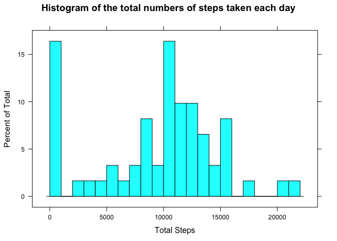
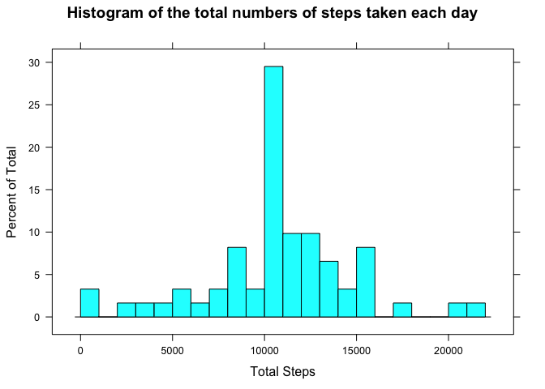

## Loading and preprocessing the data

```r
library(dplyr)

if (!file.exists("./activity.csv")) {
        unzip("./activity.zip")
}

dataset <- read.csv("activity.csv", colClasses = c("numeric", "Date", "numeric"))
print(head(dataset))
```

```
##   steps       date interval
## 1    NA 2012-10-01        0
## 2    NA 2012-10-01        5
## 3    NA 2012-10-01       10
## 4    NA 2012-10-01       15
## 5    NA 2012-10-01       20
## 6    NA 2012-10-01       25
```


## What is mean total number of steps taken per day?

### Computation of the number of steps taken each day


```r
total_steps_per_day <- dataset %>%
  as_tibble %>%
  group_by(date) %>%
  summarize(total_steps = sum(steps, na.rm = TRUE))

print(head(total_steps_per_day))
```

```
## # A tibble: 6 x 2
##   date       total_steps
##   <date>           <dbl>
## 1 2012-10-01           0
## 2 2012-10-02         126
## 3 2012-10-03       11352
## 4 2012-10-04       12116
## 5 2012-10-05       13294
## 6 2012-10-06       15420
```

### Histogram of the total number of steps taken each day


```r
library(lattice)

histogram(~ total_steps, data = total_steps_per_day, xlab = "Total Steps",
          main = "Histogram of the total numbers of steps taken each day")
```

<!-- -->

### Mean and median of the total number of steps taken each day


```r
mean <- mean(total_steps_per_day$total_steps)
median <- median(total_steps_per_day$total_steps)
```
The mean of the total number of steps taken each day is **9354.2295082**.

The median of the total number of steps taken each day is **1.0395\times 10^{4}**.

## What is the average daily activity pattern?

### Computation of the average steps for each interval


```r
average_steps_by_interval <- dataset %>%
  as_tibble %>%
  group_by(interval) %>%
  summarize(mean_steps = mean(steps, na.rm = TRUE))
```

### Time series plot of the 5-minute interval

```r
library(lattice)
xyplot(mean_steps ~ interval, type = "l", data = average_steps_by_interval,
       main = "Time series plot of the 5-minute interval",
       xlab = "Interval",
       ylab = "Average steps")
```

<!-- -->


```r
max_steps <- max(average_steps_by_interval$mean_steps)
interval_for_max_steps <- average_steps_by_interval %>%
  filter(mean_steps == max(max_steps)) %>%
  .$interval
```

The interval **835** has the maximum numbers of steps **206.1698113**

## Imputing missing values

### Total number of missing values in the dataset

```r
number_of_missing_values <- sum(!complete.cases(dataset))
```

There are **2304** missing values in the dataset.

### Imputing strategy

Missing values are replaced by the mean of steps for the corresponding intervals


```r
imputed_dataset <- dataset %>% group_by(interval) %>% mutate(steps=ifelse(is.na(steps), mean(steps, na.rm = TRUE), steps))

print(head(imputed_dataset))
```

```
## # A tibble: 6 x 3
## # Groups:   interval [6]
##    steps date       interval
##    <dbl> <date>        <dbl>
## 1 1.72   2012-10-01        0
## 2 0.340  2012-10-01        5
## 3 0.132  2012-10-01       10
## 4 0.151  2012-10-01       15
## 5 0.0755 2012-10-01       20
## 6 2.09   2012-10-01       25
```


### Histogram of the total number of steps taken each day


```r
imputed_total_steps_per_day <- imputed_dataset %>%
  as_tibble %>%
  group_by(date) %>%
  summarize(total_steps = sum(steps, na.rm = TRUE))

histogram(~ total_steps, data = imputed_total_steps_per_day, xlab = "Total Steps",
          main = "Histogram of the total numbers of steps taken each day")
```

<!-- -->

```r
imputed_mean <- mean(imputed_total_steps_per_day$total_steps)
imputed_median <- median(imputed_total_steps_per_day$total_steps)
```

The mean of of the total number of steps for the imputed dataset is **1.0766189\times 10^{4}**

The median of of the total number of steps for the imputed dataset is **1.0766189\times 10^{4}**

## Are there differences in activity patterns between weekdays and weekends?

### Factor variable telling if a date is a weekend or weekday


```r
weekday_dataset <- imputed_dataset %>%
  mutate(weekday = ifelse(as.POSIXlt(date)$wday %in% c(0, 5), "weekend", "weekday"))

print(head(weekday_dataset))
```

```
##       steps       date interval weekday
## 1 1.7169811 2012-10-01        0 weekday
## 2 0.3396226 2012-10-01        5 weekday
## 3 0.1320755 2012-10-01       10 weekday
## 4 0.1509434 2012-10-01       15 weekday
## 5 0.0754717 2012-10-01       20 weekday
## 6 2.0943396 2012-10-01       25 weekday
```

### Time series plot for week days and week ends

```r
averaged_weekday_steps <- weekday_dataset %>%
  group_by(weekday, interval) %>%
  summarize(average_steps = mean(steps))

xyplot(average_steps ~ interval | weekday, type = "l", data = averaged_weekday_steps,
       xlab = "Interval",
       ylab = "Average steps",
       layout = c(1, 2))
```

<!-- -->
